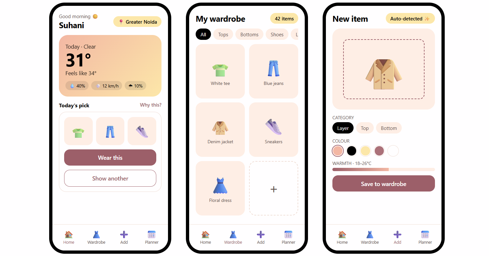
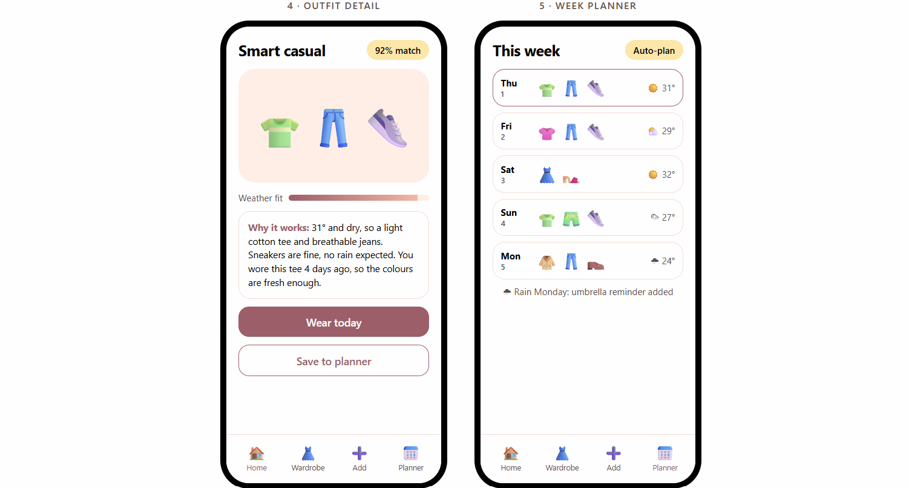

# 👗 Outfitz

**Outfitz** is a weather-aware outfit planner that suggests what to wear from *your own* wardrobe — not a generic catalog. Photograph your clothes once, and Outfitz learns to categorize and recommend outfits based on live weather and your personal style.

> Built as a DevOps class project, with a full Flutter + FastAPI + cloud-native pipeline behind it.

---

## ✨ Why Outfitz (and not just ChatGPT)

Most "AI outfit" ideas today are just a prompt wrapper around GPT — describe your clothes in text, get a text suggestion back. Outfitz is different: it actually **sees** your wardrobe.

- A custom-trained **deep learning model** classifies each photographed garment (type, color, pattern, warmth level) instead of relying on the user to manually tag everything or on an LLM to guess from a text description.
- Recommendations are generated from real image-based wardrobe data + live weather, not from an LLM hallucinating what your clothes might look like.
- This is the core differentiator: a GPT wrapper can't see your actual closet — Outfitz can.

---

## 🧵 Features

- **Weather-based suggestions** — pulls live weather data (temperature, precipitation, wind) and recommends outfits suited to the day.
- **Personal wardrobe capture** — photograph clothing items, crop them, and categorize (tops, bottoms, outerwear, footwear, accessories).
- **Deep learning classification** — an on-device/backend vision model auto-detects garment type, dominant color, and season-suitability from photos, reducing manual tagging.
- **Smart outfit generation** — combines classified wardrobe items with weather context to suggest full outfits, not just single pieces.
- **Offline-first wardrobe storage** — wardrobe data cached locally for fast access even without connectivity.

---

## 🏗️ Tech Stack

| Layer | Technology |
|---|---|
| Frontend | Flutter, Riverpod (state management), Hive (local storage) |
| Backend | FastAPI |
| ML / Deep Learning | *(model + framework — see Architecture)* |
| Infrastructure | Docker, AWS, Terraform |
| CI/CD | GitHub Actions |

---

## 🧠 Architecture

```
┌────────────┐      photo upload      ┌──────────────┐
│  Flutter   │ ──────────────────────▶│   FastAPI    │
│  (mobile)  │                        │   Backend    │
│            │◀───── outfit + tags ───│              │
└────────────┘                        └──────┬───────┘
      │                                       │
      │ weather API call                      │ inference request
      ▼                                       ▼
┌────────────┐                        ┌──────────────┐
│  Weather   │                        │  DL Model    │
│  Service   │                        │ (garment     │
└────────────┘                        │ classifier)  │
                                       └──────────────┘
```

- **Frontend (Flutter/Riverpod/Hive):** handles capture, cropping, local wardrobe cache, and UI for outfit suggestions.
- **Backend (FastAPI):** exposes endpoints for wardrobe CRUD, weather lookups, and outfit generation logic.
- **DL Model:** trained on garment classification data to tag type/color/season from uploaded images; served via the backend (or exported to TFLite/ONNX for on-device inference).
- **Infra (Docker/AWS/Terraform):** containerized backend, provisioned and deployed via Terraform, with CI/CD through GitHub Actions.

---

## 🚀 Getting Started

### Prerequisites
- Flutter SDK
- Python 3.10+
- Docker
- AWS CLI configured (for deployment)

### Frontend
```bash
git clone https://github.com/suhaninagwani/outfitz.git
cd outfitz
flutter pub get
flutter run
```

### Backend
```bash
cd backend
python -m venv venv
source venv/bin/activate  # or venv\Scripts\activate on Windows
pip install -r requirements.txt
uvicorn main:app --reload
```

---

## 🗺️ Roadmap

- [ ] Wardrobe capture + crop + manual categorize
- [ ] Weather API integration
- [ ] Rule-based outfit suggestion (MVP)
- [ ] Deep learning garment classifier (v1)
- [ ] Personalized outfit ranking based on past choices
- [ ] CI/CD pipeline (GitHub Actions → Docker → AWS via Terraform)
- [ ] Deploy to production

---
PREVIEW:
<p align="center">
  
  
  
</p>
---